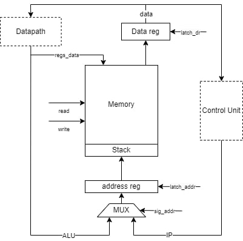
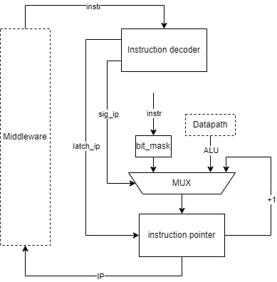
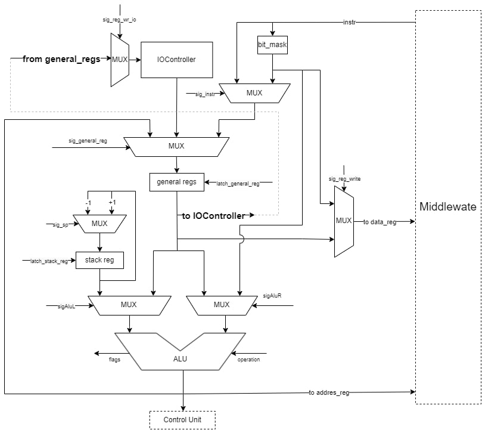

# Архитектура компьютера, 3 лабораторная
## Зинченко Антон Андреевич P3206

Вариант: alg -> asm | risc | neum | hw | instr | binary -> struct | stream | port | pstr | prob1 | cache

Базовый вариант

## Язык программирования - Алгоритмический 
### Синтаксис языка
```ebnf
<program> ::= <statement>
<statement> ::= "while (" <expression> ")" "{" <statement> "}"
              | "if (" <expression> ")" "{" <statement> "}" |
              | <var> " = " <expression> | <input_string> ";"
              | "let " <var> " = "  <expression> | <input_string> ";"
              | "print_int (" {expression} ");"
              | "print_str (" (<var> | "'" <string> "'") ");"

<expression> ::= {<expression_unit>}
<expression_unit> ::= [(<operand> | ")")] [<term>] [(<operand> | "(")]
<term> ::= "+" | "-" | "*" | "/" | "%" | "|" | "==" | "!=" | ">" | "<" 
<operand> ::= <var> | <num> | <input_int> 
<input_string> ::= "input_str"
<input_int> ::= "input_int"
<num> ::= -?[0-9]+
<var> ::= [a-zA-Z]*
<string> ::= [\w\s,.:;!?()\\-]+
```
### Пример кода
```js
let total = 0;
let number = input_int;
let counter = 0;
while (counter < number+1) {
    if (counter % 3 == 0 | counter % 5 == 0) {
        total = total + counter;
    }
    counter = counter + 1;
}
print_int(total);
```

## Организация памяти

Память организвана согласно модели Фон Неймана, где память данных и инструкций едина

- Память организована в виде массива байт, где машинное слово составляет 4 байта

- Доступно 8 регистров общего назначения

- Запись и Чтение из памяти осуществляется отдельными командами(load и store)

## Система команд

### Инструкции

#### Формат машинных инструкций
Все инструкции представлены в бинарном виде в формате:
```
Опкод | Тип адресации | Номер регистра(Первый операнд) | Второй операнд
00000 | 0             | 0000                           | 0000000000000000000000
```
- Тип адресации - \
если 0, значит адресация через значение в регистре \
если 1, значит адресация непосредственная

#### Инструкции с памятью
`load | type | regf | regs/val` - Загрузить значение по адресу **val**(либо лежащему в регистре **regs**) в регистр **regf**

`store | type | regr | regs/val` - Загрузить значение регистра **regf** по адресу **val**(либо лежащему в регистре **regs**)

#### Инструкции ветвления
`jump | type | - | regs/val` - Безусловный переход по адресу **val**(либо лежащему в регистре **regs**)

`jumpz | type | - | regs/val` - Безусловный переход по адресу **val**(либо лежащему в регистре **regs**) если выставлен флаг **Z**

`jumpnz | type | - | regs/val` - Безусловный переход по адресу **val**(либо лежащему в регистре **regs**) если не выставлен флаг **Z**

`jumpneg | type | - | regs/val` - Безусловный переход по адресу **val**(либо лежащему в регистре **regs**) если выставлен флаг **N**

`jumpnneg | type | - | regs/val` - Безусловный переход по адресу **val**(либо лежащему в регистре **regs**) если не выставлен флаг **N**

#### Арифметические операции
`add | type | regf | regs/val` - Сложить значения регистров **regf** и **regs**(либо **val**) и положить результат в **regf**

`sub | type | regf | regs/val` - Вычесть значения регистров **regf** и **regs**(либо **val**) и положить результат в **regf** 

`mul | type | regf | regs/val` - Перемножить значения регистров **regf** и **regs**(либо **val**) и положить результат в **regf** 

`div | type | regf | regs/val` - Поделить значения регистров **regf** и **regs**(либо **val**) и положить результат в **regf** 

`mod | type | regf | regs/val` - Получить остаток от делания значения регистров **regf** и **regs**(либо **val**) и положить результат в **regf** 

`or | type | regf | regs/val` - Выполнить операцию побитового "ИЛИ" между значениями регистров **regf** и **regs**(либо **val**) и положить результат в **regf** 

`inc | - | regf | -` - Увеличить значение регистра **regf** на 1

`dec | - | regf | -` - Уменьшить значение регистра **regf** на 1

#### Операции сравнения
`cmp | type | regf | regs/val` - Вычесть значения регистров **regf** и **regs**(либо **val**) для выставления флагов

#### Операции со стеком
`push | type | - | regs/val` - Положить на стек значение регистра **regs**(либо **val**) 

`pop | type | - | regs` - Снять со стека значение и положить в регистр **regs**

`sload | type | regf | regs/val` - Загрузить значение, лежащее по адресу суммы регистров **sp** и **regs**(либо **val**) и положить результат в регистр **regf**

#### Операции ввода-вывода
`in | - | regf | port` - Считать данные с внешнего устройства по порту **port** в регистр **regf**

`out | - | regf | port` - Отправить значение регистра **regf** на внешнее устройство по порту **port**

#### Остальные операции
`mov | type | regf | regs/val` - Загрузить значение регистра **regs**(либо **val**) в регистр **regf**

`halt | - | - | -` - Остановка процессора

## Транслятор
Интерфейс командной строки: `python translator.py <input_file> <target_file>`

Реализация представлена в [translator](./translator/)

Трансляция происходит в 2 этапа:
- Парсинг текста программы и преобразование его в последовательность токенов
- Генерация машинного кода

## Модель процессора
Интерфейс командной строки: `python main.py <target_file> <input_str_file> <input_int_file> <output_str_file> <output_int_file> <log_file>`

Реализация представлена в [processor](./CPU/)

### Middleware


На схеме представлена общая схема процессора. Схема Datapath-а и Control Unit-а приведены ниже.

Процессор разделен на 3 условные части: Datapath, Control Unit и Middleware.

Middleware включает в себя память, регистр адреса и регистр данных.

Выборка ячейки осуществляется по адресу, лежащему в регистре адреса.
Туда может быть записан результат выполнения операции в АЛУ, либо адрес из указателя инструкции(IP).

Чтение из памяти осуществляется в регистр данных, а запись из регистра данных и регистров общего назначения.

Также реализован стек. Он находится "внизу" памяти, и по ходу добавления новых элемент он растет "вверх".
Соответственно при выполнении команды `push` указатель стека уменьшается, а при `pop` увеличивается.

### Control Unit


На схеме представлена модель Control Unit-а

Control Unit включает в себя декодер инструкций и указатель инструкций.

В IP может быть защелкнут результат АЛУ, инкрементированное значение IP и адрес из 2 операнда инструкции.

Битовая маска зануляет первые 10 бит инструкции, чтобы остался только 2 операнд.

### Datapath


На схеме предоставлена модель Datapath-а

Datapath включает в себя регистры общего назначения, указатель стека и АЛУ.

Также на схеме отображен контроллер ввода-вывода.

В регистры общего назначения может быть записан результат выполнения операции в АЛУ, 
значение регистра данных(инструкция/данные), 2 операнд инструкции(также из регистра данных) и данные из IO контроллера.

На левый вход АЛУ может быть подано значение одного из регистров общего назначения, либо указателя стека.

На правый вход АЛУ может быть подано значение одного из регистров общего назначения, 
либо 2 операнд инструкции(из регистра данных).

#### Флаги
В результате выполнения операции АЛУ выставляет 2 флага:
- zero - результат операции равен нулю
- neg - результат операции отрицателен

## Тестирование
Интерфейс командной строки: `python -m pytest golden_test.py`

Реализация представлена в [golden_test](./golden_test.py).

Тестирование происходит с использование golden tests в формате yaml файлов. Тесты лежат в папке [tests](./tests/).

Тестирование реализованы в виде скрипта на Python с использованием библиотеки pytest.

Каждый тест содержит в себе:
- Исходный код на высокоуровневом языке программирования
- Входные данные в json формате
- Результат работы транслятора
- Вывод программы(json файл, созданный IO контроллером)
- Журнал работы процессора

Тесты представлены для следующих программ:
- [hello](./tests/programs/hello.txt)
- [cat](./tests/programs/cat.txt)
- [hello_user](./tests/programs/hello_user.txt)
- [prob1](./tests/programs/prob1.txt)

### Пример использования на примере программы cat
```commandline
(venv) user@user:~/Desktop/CPU-risc-simulation$ cat ./CPU/inputs/input_str.json 
{
    "inputs": [
      5, "S", "a", "s", "h", "a"
    ]
  }
(venv) user@user:~/Desktop/CPU-risc-simulation$ cat ./tests/programs/cat.txt 
let name = input_str;
print_str(name);
(venv) user@user:~/Desktop/CPU-risc-simulation$ python3 ./translator/translator.py ./tests/programs/cat.txt ./CPU/programs/comp 
(venv) user@user:~/Desktop/CPU-risc-simulation$ cat ./CPU/programs/mnem_comp.txt 
01100000010000000000000000000001 - 0    0x60400001      IN      #1      $1
01001100010000000000000000010100 - 1    0x4c400014      CMP     #1      $20
10100100000000000000000000000100 - 2    0xa4000004      JUMPNEG $4
10110100010000000000000000010100 - 3    0xb4400014      MOV     #1      $20
10000100010000000000000000011001 - 4    0x84400019      STORE   #1      $25
10110100110000000000000000011001 - 5    0xb4c00019      MOV     #3      $25
00001100010000000000000000000001 - 6    0xc400001       SUB     #1      $1
00000100110000000000000000000001 - 7    0x4c00001       ADD     #3      $1
01100000100000000000000000000001 - 8    0x60800001      IN      #2      $1
10000000100000000000000000000011 - 9    0x80800003      STORE   #2      #3
01001100010000000000000000000000 - 10   0x4c400000      CMP     #1      $0
10011100000000000000000000000110 - 11   0x9c000006      JUMPNZ  $6
10110100010000000000000000011001 - 12   0xb4400019      MOV     #1      $25
10000100010000000000000000011000 - 13   0x84400018      STORE   #1      $24
01110100010000000000000000011000 - 14   0x74400018      LOAD    #1      $24
01110000100000000000000000000001 - 15   0x70800001      LOAD    #2      #1
01001100100000000000000000000000 - 16   0x4c800000      CMP     #2      $0
10010100000000000000000000010111 - 17   0x94000017      JUMPZ   $23
00001100100000000000000000000001 - 18   0xc800001       SUB     #2      $1
00000100010000000000000000000001 - 19   0x4400001       ADD     #1      $1
01110000110000000000000000000001 - 20   0x70c00001      LOAD    #3      #1
01101000110000000000000000000001 - 21   0x68c00001      OUT     #3      $1
10001100000000000000000000010000 - 22   0x8c000010      JUMP    $16
10111000000000000000000000000000 - 23   0xb8000000      HALT
(venv) user@user:~/Desktop/CPU-risc-simulation$ python3 ./translator/translator.py ./tests/programs/cat.txt 
(venv) user@user:~/Desktop/CPU-risc-simulation$ python3 ./CPU/main.py ./CPU/programs/comp ./CPU/inputs/input_str.json ./CPU/inputs/input_int.json ./CPU/outputs/output_str.json ./CPU/outputs/output_int.json ./CPU/log.txt
(venv) user@user:~/Desktop/CPU-risc-simulation$ cat ./CPU/outputs/output_str.json
{"outputs": ["S", "a", "s", "h", "a"]}
(venv) user@user:~/Desktop/CPU-risc-simulation$ cat ./CPU/log.txt 
pc: 0 | ar: 0 | dr: 0x60400001 | r1: 0 | r2: 0 | r3: 0 | r4: 0 | r5: 0 | r6: 0 | r7: 0 | r8: 0 | sp: 4194304 | zf: 0 | of: 0 | ng: 0 | 
command: 0xc - IN | pc: 0 -> 1 | ar: 0 | dr: 0x60400001 | r1: 0 -> 5 | r2: 0 | r3: 0 | r4: 0 | r5: 0 | r6: 0 | r7: 0 | r8: 0 | sp: 4194304 | zf: 0 | of: 0 | ng: 0 | 
command: 0x9 - CMP | pc: 1 -> 2 | ar: 0 -> 1 | dr: 0x4c400014 | r1: 5 | r2: 0 | r3: 0 | r4: 0 | r5: 0 | r6: 0 | r7: 0 | r8: 0 | sp: 4194304 | zf: 0 | of: 0 | ng: 0 -> 1 | 
command: 0x14 - JUMPNEG | pc: 2 -> 4 | ar: 1 -> 2 | dr: 0xa4000004 | r1: 5 | r2: 0 | r3: 0 | r4: 0 | r5: 0 | r6: 0 | r7: 0 | r8: 0 | sp: 4194304 | zf: 0 | of: 0 | ng: 1 | 
command: 0x10 - STORE | pc: 4 -> 5 | ar: 2 -> 25 | dr: 0x84400019 | r1: 5 | r2: 0 | r3: 0 | r4: 0 | r5: 0 | r6: 0 | r7: 0 | r8: 0 | sp: 4194304 | zf: 0 | of: 0 | ng: 1 -> 0 | 
command: 0x16 - MOV | pc: 5 -> 6 | ar: 25 -> 5 | dr: 0xb4c00019 | r1: 5 | r2: 0 | r3: 0 -> 25 | r4: 0 | r5: 0 | r6: 0 | r7: 0 | r8: 0 | sp: 4194304 | zf: 0 | of: 0 | ng: 0 | 
command: 0x1 - SUB | pc: 6 -> 7 | ar: 5 -> 6 | dr: 0xc400001 | r1: 5 -> 4 | r2: 0 | r3: 25 | r4: 0 | r5: 0 | r6: 0 | r7: 0 | r8: 0 | sp: 4194304 | zf: 0 | of: 0 | ng: 0 | 
command: 0x0 - ADD | pc: 7 -> 8 | ar: 6 -> 7 | dr: 0x4c00001 | r1: 4 | r2: 0 | r3: 25 -> 26 | r4: 0 | r5: 0 | r6: 0 | r7: 0 | r8: 0 | sp: 4194304 | zf: 0 | of: 0 | ng: 0 | 
command: 0xc - IN | pc: 8 -> 9 | ar: 7 -> 8 | dr: 0x60800001 | r1: 4 | r2: 0 -> 83 | r3: 26 | r4: 0 | r5: 0 | r6: 0 | r7: 0 | r8: 0 | sp: 4194304 | zf: 0 | of: 0 | ng: 0 | 
command: 0x10 - STORE | pc: 9 -> 10 | ar: 8 -> 26 | dr: 0x80800003 | r1: 4 | r2: 83 | r3: 26 | r4: 0 | r5: 0 | r6: 0 | r7: 0 | r8: 0 | sp: 4194304 | zf: 0 | of: 0 | ng: 0 | 
command: 0x9 - CMP | pc: 10 -> 11 | ar: 26 -> 10 | dr: 0x4c400000 | r1: 4 | r2: 83 | r3: 26 | r4: 0 | r5: 0 | r6: 0 | r7: 0 | r8: 0 | sp: 4194304 | zf: 0 | of: 0 | ng: 0 | 
command: 0x13 - JUMPNZ | pc: 11 -> 6 | ar: 10 -> 11 | dr: 0x9c000006 | r1: 4 | r2: 83 | r3: 26 | r4: 0 | r5: 0 | r6: 0 | r7: 0 | r8: 0 | sp: 4194304 | zf: 0 | of: 0 | ng: 0 | 
command: 0x1 - SUB | pc: 6 -> 7 | ar: 11 -> 6 | dr: 0xc400001 | r1: 4 -> 3 | r2: 83 | r3: 26 | r4: 0 | r5: 0 | r6: 0 | r7: 0 | r8: 0 | sp: 4194304 | zf: 0 | of: 0 | ng: 0 | 
command: 0x0 - ADD | pc: 7 -> 8 | ar: 6 -> 7 | dr: 0x4c00001 | r1: 3 | r2: 83 | r3: 26 -> 27 | r4: 0 | r5: 0 | r6: 0 | r7: 0 | r8: 0 | sp: 4194304 | zf: 0 | of: 0 | ng: 0 | 
command: 0xc - IN | pc: 8 -> 9 | ar: 7 -> 8 | dr: 0x60800001 | r1: 3 | r2: 83 -> 97 | r3: 27 | r4: 0 | r5: 0 | r6: 0 | r7: 0 | r8: 0 | sp: 4194304 | zf: 0 | of: 0 | ng: 0 | 
command: 0x10 - STORE | pc: 9 -> 10 | ar: 8 -> 27 | dr: 0x80800003 | r1: 3 | r2: 97 | r3: 27 | r4: 0 | r5: 0 | r6: 0 | r7: 0 | r8: 0 | sp: 4194304 | zf: 0 | of: 0 | ng: 0 | 
command: 0x9 - CMP | pc: 10 -> 11 | ar: 27 -> 10 | dr: 0x4c400000 | r1: 3 | r2: 97 | r3: 27 | r4: 0 | r5: 0 | r6: 0 | r7: 0 | r8: 0 | sp: 4194304 | zf: 0 | of: 0 | ng: 0 | 
command: 0x13 - JUMPNZ | pc: 11 -> 6 | ar: 10 -> 11 | dr: 0x9c000006 | r1: 3 | r2: 97 | r3: 27 | r4: 0 | r5: 0 | r6: 0 | r7: 0 | r8: 0 | sp: 4194304 | zf: 0 | of: 0 | ng: 0 | 
command: 0x1 - SUB | pc: 6 -> 7 | ar: 11 -> 6 | dr: 0xc400001 | r1: 3 -> 2 | r2: 97 | r3: 27 | r4: 0 | r5: 0 | r6: 0 | r7: 0 | r8: 0 | sp: 4194304 | zf: 0 | of: 0 | ng: 0 | 
command: 0x0 - ADD | pc: 7 -> 8 | ar: 6 -> 7 | dr: 0x4c00001 | r1: 2 | r2: 97 | r3: 27 -> 28 | r4: 0 | r5: 0 | r6: 0 | r7: 0 | r8: 0 | sp: 4194304 | zf: 0 | of: 0 | ng: 0 | 
command: 0xc - IN | pc: 8 -> 9 | ar: 7 -> 8 | dr: 0x60800001 | r1: 2 | r2: 97 -> 115 | r3: 28 | r4: 0 | r5: 0 | r6: 0 | r7: 0 | r8: 0 | sp: 4194304 | zf: 0 | of: 0 | ng: 0 | 
command: 0x10 - STORE | pc: 9 -> 10 | ar: 8 -> 28 | dr: 0x80800003 | r1: 2 | r2: 115 | r3: 28 | r4: 0 | r5: 0 | r6: 0 | r7: 0 | r8: 0 | sp: 4194304 | zf: 0 | of: 0 | ng: 0 | 
command: 0x9 - CMP | pc: 10 -> 11 | ar: 28 -> 10 | dr: 0x4c400000 | r1: 2 | r2: 115 | r3: 28 | r4: 0 | r5: 0 | r6: 0 | r7: 0 | r8: 0 | sp: 4194304 | zf: 0 | of: 0 | ng: 0 | 
command: 0x13 - JUMPNZ | pc: 11 -> 6 | ar: 10 -> 11 | dr: 0x9c000006 | r1: 2 | r2: 115 | r3: 28 | r4: 0 | r5: 0 | r6: 0 | r7: 0 | r8: 0 | sp: 4194304 | zf: 0 | of: 0 | ng: 0 | 
command: 0x1 - SUB | pc: 6 -> 7 | ar: 11 -> 6 | dr: 0xc400001 | r1: 2 -> 1 | r2: 115 | r3: 28 | r4: 0 | r5: 0 | r6: 0 | r7: 0 | r8: 0 | sp: 4194304 | zf: 0 | of: 0 | ng: 0 | 
command: 0x0 - ADD | pc: 7 -> 8 | ar: 6 -> 7 | dr: 0x4c00001 | r1: 1 | r2: 115 | r3: 28 -> 29 | r4: 0 | r5: 0 | r6: 0 | r7: 0 | r8: 0 | sp: 4194304 | zf: 0 | of: 0 | ng: 0 | 
command: 0xc - IN | pc: 8 -> 9 | ar: 7 -> 8 | dr: 0x60800001 | r1: 1 | r2: 115 -> 104 | r3: 29 | r4: 0 | r5: 0 | r6: 0 | r7: 0 | r8: 0 | sp: 4194304 | zf: 0 | of: 0 | ng: 0 | 
command: 0x10 - STORE | pc: 9 -> 10 | ar: 8 -> 29 | dr: 0x80800003 | r1: 1 | r2: 104 | r3: 29 | r4: 0 | r5: 0 | r6: 0 | r7: 0 | r8: 0 | sp: 4194304 | zf: 0 | of: 0 | ng: 0 | 
command: 0x9 - CMP | pc: 10 -> 11 | ar: 29 -> 10 | dr: 0x4c400000 | r1: 1 | r2: 104 | r3: 29 | r4: 0 | r5: 0 | r6: 0 | r7: 0 | r8: 0 | sp: 4194304 | zf: 0 | of: 0 | ng: 0 | 
command: 0x13 - JUMPNZ | pc: 11 -> 6 | ar: 10 -> 11 | dr: 0x9c000006 | r1: 1 | r2: 104 | r3: 29 | r4: 0 | r5: 0 | r6: 0 | r7: 0 | r8: 0 | sp: 4194304 | zf: 0 | of: 0 | ng: 0 | 
command: 0x1 - SUB | pc: 6 -> 7 | ar: 11 -> 6 | dr: 0xc400001 | r1: 1 -> 0 | r2: 104 | r3: 29 | r4: 0 | r5: 0 | r6: 0 | r7: 0 | r8: 0 | sp: 4194304 | zf: 0 -> 1 | of: 0 | ng: 0 | 
command: 0x0 - ADD | pc: 7 -> 8 | ar: 6 -> 7 | dr: 0x4c00001 | r1: 0 | r2: 104 | r3: 29 -> 30 | r4: 0 | r5: 0 | r6: 0 | r7: 0 | r8: 0 | sp: 4194304 | zf: 1 -> 0 | of: 0 | ng: 0 | 
command: 0xc - IN | pc: 8 -> 9 | ar: 7 -> 8 | dr: 0x60800001 | r1: 0 | r2: 104 -> 97 | r3: 30 | r4: 0 | r5: 0 | r6: 0 | r7: 0 | r8: 0 | sp: 4194304 | zf: 0 | of: 0 | ng: 0 | 
command: 0x10 - STORE | pc: 9 -> 10 | ar: 8 -> 30 | dr: 0x80800003 | r1: 0 | r2: 97 | r3: 30 | r4: 0 | r5: 0 | r6: 0 | r7: 0 | r8: 0 | sp: 4194304 | zf: 0 | of: 0 | ng: 0 | 
command: 0x9 - CMP | pc: 10 -> 11 | ar: 30 -> 10 | dr: 0x4c400000 | r1: 0 | r2: 97 | r3: 30 | r4: 0 | r5: 0 | r6: 0 | r7: 0 | r8: 0 | sp: 4194304 | zf: 0 -> 1 | of: 0 | ng: 0 | 
command: 0x13 - JUMPNZ | pc: 11 -> 12 | ar: 10 -> 11 | dr: 0x9c000006 | r1: 0 | r2: 97 | r3: 30 | r4: 0 | r5: 0 | r6: 0 | r7: 0 | r8: 0 | sp: 4194304 | zf: 1 | of: 0 | ng: 0 | 
command: 0x16 - MOV | pc: 12 -> 13 | ar: 11 -> 12 | dr: 0xb4400019 | r1: 0 -> 25 | r2: 97 | r3: 30 | r4: 0 | r5: 0 | r6: 0 | r7: 0 | r8: 0 | sp: 4194304 | zf: 1 | of: 0 | ng: 0 | 
command: 0x10 - STORE | pc: 13 -> 14 | ar: 12 -> 24 | dr: 0x84400018 | r1: 25 | r2: 97 | r3: 30 | r4: 0 | r5: 0 | r6: 0 | r7: 0 | r8: 0 | sp: 4194304 | zf: 1 -> 0 | of: 0 | ng: 0 | 
command: 0xe - LOAD | pc: 14 -> 15 | ar: 24 | dr: 0x19 | r1: 25 | r2: 97 | r3: 30 | r4: 0 | r5: 0 | r6: 0 | r7: 0 | r8: 0 | sp: 4194304 | zf: 0 | of: 0 | ng: 0 | 
command: 0xe - LOAD | pc: 15 -> 16 | ar: 24 -> 25 | dr: 0x5 | r1: 25 | r2: 97 -> 5 | r3: 30 | r4: 0 | r5: 0 | r6: 0 | r7: 0 | r8: 0 | sp: 4194304 | zf: 0 | of: 0 | ng: 0 | 
command: 0x9 - CMP | pc: 16 -> 17 | ar: 25 -> 16 | dr: 0x4c800000 | r1: 25 | r2: 5 | r3: 30 | r4: 0 | r5: 0 | r6: 0 | r7: 0 | r8: 0 | sp: 4194304 | zf: 0 | of: 0 | ng: 0 | 
command: 0x12 - JUMPZ | pc: 17 -> 18 | ar: 16 -> 17 | dr: 0x94000017 | r1: 25 | r2: 5 | r3: 30 | r4: 0 | r5: 0 | r6: 0 | r7: 0 | r8: 0 | sp: 4194304 | zf: 0 | of: 0 | ng: 0 | 
command: 0x1 - SUB | pc: 18 -> 19 | ar: 17 -> 18 | dr: 0xc800001 | r1: 25 | r2: 5 -> 4 | r3: 30 | r4: 0 | r5: 0 | r6: 0 | r7: 0 | r8: 0 | sp: 4194304 | zf: 0 | of: 0 | ng: 0 | 
command: 0x0 - ADD | pc: 19 -> 20 | ar: 18 -> 19 | dr: 0x4400001 | r1: 25 -> 26 | r2: 4 | r3: 30 | r4: 0 | r5: 0 | r6: 0 | r7: 0 | r8: 0 | sp: 4194304 | zf: 0 | of: 0 | ng: 0 | 
command: 0xe - LOAD | pc: 20 -> 21 | ar: 19 -> 26 | dr: 0x53 | r1: 26 | r2: 4 | r3: 30 -> 83 | r4: 0 | r5: 0 | r6: 0 | r7: 0 | r8: 0 | sp: 4194304 | zf: 0 | of: 0 | ng: 0 | 
command: 0xd - OUT | pc: 21 -> 22 | ar: 26 -> 21 | dr: 0x68c00001 | r1: 26 | r2: 4 | r3: 83 | r4: 0 | r5: 0 | r6: 0 | r7: 0 | r8: 0 | sp: 4194304 | zf: 0 | of: 0 | ng: 0 | 
command: 0x11 - JUMP | pc: 22 -> 16 | ar: 21 -> 22 | dr: 0x8c000010 | r1: 26 | r2: 4 | r3: 83 | r4: 0 | r5: 0 | r6: 0 | r7: 0 | r8: 0 | sp: 4194304 | zf: 0 | of: 0 | ng: 0 | 
command: 0x9 - CMP | pc: 16 -> 17 | ar: 22 -> 16 | dr: 0x4c800000 | r1: 26 | r2: 4 | r3: 83 | r4: 0 | r5: 0 | r6: 0 | r7: 0 | r8: 0 | sp: 4194304 | zf: 0 | of: 0 | ng: 0 | 
command: 0x12 - JUMPZ | pc: 17 -> 18 | ar: 16 -> 17 | dr: 0x94000017 | r1: 26 | r2: 4 | r3: 83 | r4: 0 | r5: 0 | r6: 0 | r7: 0 | r8: 0 | sp: 4194304 | zf: 0 | of: 0 | ng: 0 | 
command: 0x1 - SUB | pc: 18 -> 19 | ar: 17 -> 18 | dr: 0xc800001 | r1: 26 | r2: 4 -> 3 | r3: 83 | r4: 0 | r5: 0 | r6: 0 | r7: 0 | r8: 0 | sp: 4194304 | zf: 0 | of: 0 | ng: 0 | 
command: 0x0 - ADD | pc: 19 -> 20 | ar: 18 -> 19 | dr: 0x4400001 | r1: 26 -> 27 | r2: 3 | r3: 83 | r4: 0 | r5: 0 | r6: 0 | r7: 0 | r8: 0 | sp: 4194304 | zf: 0 | of: 0 | ng: 0 | 
command: 0xe - LOAD | pc: 20 -> 21 | ar: 19 -> 27 | dr: 0x61 | r1: 27 | r2: 3 | r3: 83 -> 97 | r4: 0 | r5: 0 | r6: 0 | r7: 0 | r8: 0 | sp: 4194304 | zf: 0 | of: 0 | ng: 0 | 
command: 0xd - OUT | pc: 21 -> 22 | ar: 27 -> 21 | dr: 0x68c00001 | r1: 27 | r2: 3 | r3: 97 | r4: 0 | r5: 0 | r6: 0 | r7: 0 | r8: 0 | sp: 4194304 | zf: 0 | of: 0 | ng: 0 | 
command: 0x11 - JUMP | pc: 22 -> 16 | ar: 21 -> 22 | dr: 0x8c000010 | r1: 27 | r2: 3 | r3: 97 | r4: 0 | r5: 0 | r6: 0 | r7: 0 | r8: 0 | sp: 4194304 | zf: 0 | of: 0 | ng: 0 | 
command: 0x9 - CMP | pc: 16 -> 17 | ar: 22 -> 16 | dr: 0x4c800000 | r1: 27 | r2: 3 | r3: 97 | r4: 0 | r5: 0 | r6: 0 | r7: 0 | r8: 0 | sp: 4194304 | zf: 0 | of: 0 | ng: 0 | 
command: 0x12 - JUMPZ | pc: 17 -> 18 | ar: 16 -> 17 | dr: 0x94000017 | r1: 27 | r2: 3 | r3: 97 | r4: 0 | r5: 0 | r6: 0 | r7: 0 | r8: 0 | sp: 4194304 | zf: 0 | of: 0 | ng: 0 | 
command: 0x1 - SUB | pc: 18 -> 19 | ar: 17 -> 18 | dr: 0xc800001 | r1: 27 | r2: 3 -> 2 | r3: 97 | r4: 0 | r5: 0 | r6: 0 | r7: 0 | r8: 0 | sp: 4194304 | zf: 0 | of: 0 | ng: 0 | 
command: 0x0 - ADD | pc: 19 -> 20 | ar: 18 -> 19 | dr: 0x4400001 | r1: 27 -> 28 | r2: 2 | r3: 97 | r4: 0 | r5: 0 | r6: 0 | r7: 0 | r8: 0 | sp: 4194304 | zf: 0 | of: 0 | ng: 0 | 
command: 0xe - LOAD | pc: 20 -> 21 | ar: 19 -> 28 | dr: 0x73 | r1: 28 | r2: 2 | r3: 97 -> 115 | r4: 0 | r5: 0 | r6: 0 | r7: 0 | r8: 0 | sp: 4194304 | zf: 0 | of: 0 | ng: 0 | 
command: 0xd - OUT | pc: 21 -> 22 | ar: 28 -> 21 | dr: 0x68c00001 | r1: 28 | r2: 2 | r3: 115 | r4: 0 | r5: 0 | r6: 0 | r7: 0 | r8: 0 | sp: 4194304 | zf: 0 | of: 0 | ng: 0 | 
command: 0x11 - JUMP | pc: 22 -> 16 | ar: 21 -> 22 | dr: 0x8c000010 | r1: 28 | r2: 2 | r3: 115 | r4: 0 | r5: 0 | r6: 0 | r7: 0 | r8: 0 | sp: 4194304 | zf: 0 | of: 0 | ng: 0 | 
command: 0x9 - CMP | pc: 16 -> 17 | ar: 22 -> 16 | dr: 0x4c800000 | r1: 28 | r2: 2 | r3: 115 | r4: 0 | r5: 0 | r6: 0 | r7: 0 | r8: 0 | sp: 4194304 | zf: 0 | of: 0 | ng: 0 | 
command: 0x12 - JUMPZ | pc: 17 -> 18 | ar: 16 -> 17 | dr: 0x94000017 | r1: 28 | r2: 2 | r3: 115 | r4: 0 | r5: 0 | r6: 0 | r7: 0 | r8: 0 | sp: 4194304 | zf: 0 | of: 0 | ng: 0 | 
command: 0x1 - SUB | pc: 18 -> 19 | ar: 17 -> 18 | dr: 0xc800001 | r1: 28 | r2: 2 -> 1 | r3: 115 | r4: 0 | r5: 0 | r6: 0 | r7: 0 | r8: 0 | sp: 4194304 | zf: 0 | of: 0 | ng: 0 | 
command: 0x0 - ADD | pc: 19 -> 20 | ar: 18 -> 19 | dr: 0x4400001 | r1: 28 -> 29 | r2: 1 | r3: 115 | r4: 0 | r5: 0 | r6: 0 | r7: 0 | r8: 0 | sp: 4194304 | zf: 0 | of: 0 | ng: 0 | 
command: 0xe - LOAD | pc: 20 -> 21 | ar: 19 -> 29 | dr: 0x68 | r1: 29 | r2: 1 | r3: 115 -> 104 | r4: 0 | r5: 0 | r6: 0 | r7: 0 | r8: 0 | sp: 4194304 | zf: 0 | of: 0 | ng: 0 | 
command: 0xd - OUT | pc: 21 -> 22 | ar: 29 -> 21 | dr: 0x68c00001 | r1: 29 | r2: 1 | r3: 104 | r4: 0 | r5: 0 | r6: 0 | r7: 0 | r8: 0 | sp: 4194304 | zf: 0 | of: 0 | ng: 0 | 
command: 0x11 - JUMP | pc: 22 -> 16 | ar: 21 -> 22 | dr: 0x8c000010 | r1: 29 | r2: 1 | r3: 104 | r4: 0 | r5: 0 | r6: 0 | r7: 0 | r8: 0 | sp: 4194304 | zf: 0 | of: 0 | ng: 0 | 
command: 0x9 - CMP | pc: 16 -> 17 | ar: 22 -> 16 | dr: 0x4c800000 | r1: 29 | r2: 1 | r3: 104 | r4: 0 | r5: 0 | r6: 0 | r7: 0 | r8: 0 | sp: 4194304 | zf: 0 | of: 0 | ng: 0 | 
command: 0x12 - JUMPZ | pc: 17 -> 18 | ar: 16 -> 17 | dr: 0x94000017 | r1: 29 | r2: 1 | r3: 104 | r4: 0 | r5: 0 | r6: 0 | r7: 0 | r8: 0 | sp: 4194304 | zf: 0 | of: 0 | ng: 0 | 
command: 0x1 - SUB | pc: 18 -> 19 | ar: 17 -> 18 | dr: 0xc800001 | r1: 29 | r2: 1 -> 0 | r3: 104 | r4: 0 | r5: 0 | r6: 0 | r7: 0 | r8: 0 | sp: 4194304 | zf: 0 -> 1 | of: 0 | ng: 0 | 
command: 0x0 - ADD | pc: 19 -> 20 | ar: 18 -> 19 | dr: 0x4400001 | r1: 29 -> 30 | r2: 0 | r3: 104 | r4: 0 | r5: 0 | r6: 0 | r7: 0 | r8: 0 | sp: 4194304 | zf: 1 -> 0 | of: 0 | ng: 0 | 
command: 0xe - LOAD | pc: 20 -> 21 | ar: 19 -> 30 | dr: 0x61 | r1: 30 | r2: 0 | r3: 104 -> 97 | r4: 0 | r5: 0 | r6: 0 | r7: 0 | r8: 0 | sp: 4194304 | zf: 0 | of: 0 | ng: 0 | 
command: 0xd - OUT | pc: 21 -> 22 | ar: 30 -> 21 | dr: 0x68c00001 | r1: 30 | r2: 0 | r3: 97 | r4: 0 | r5: 0 | r6: 0 | r7: 0 | r8: 0 | sp: 4194304 | zf: 0 | of: 0 | ng: 0 | 
command: 0x11 - JUMP | pc: 22 -> 16 | ar: 21 -> 22 | dr: 0x8c000010 | r1: 30 | r2: 0 | r3: 97 | r4: 0 | r5: 0 | r6: 0 | r7: 0 | r8: 0 | sp: 4194304 | zf: 0 | of: 0 | ng: 0 | 
command: 0x9 - CMP | pc: 16 -> 17 | ar: 22 -> 16 | dr: 0x4c800000 | r1: 30 | r2: 0 | r3: 97 | r4: 0 | r5: 0 | r6: 0 | r7: 0 | r8: 0 | sp: 4194304 | zf: 0 -> 1 | of: 0 | ng: 0 | 
command: 0x12 - JUMPZ | pc: 17 -> 23 | ar: 16 -> 17 | dr: 0x94000017 | r1: 30 | r2: 0 | r3: 97 | r4: 0 | r5: 0 | r6: 0 | r7: 0 | r8: 0 | sp: 4194304 | zf: 1 | of: 0 | ng: 0 | 
(venv) user@user:~/Desktop/CPU-risc-simulation$ 
```

### Пример проверки исходного кода
```commandline
(venv) user@user:~/Desktop/CPU-risc-simulation$ python -m pytest golden_test.py 
/home/user/Desktop/CPU-risc-simulation/venv/lib/python3.12/site-packages/pytest_golden/plugin.py:53: GoldenTestUsageWarning: Add 'enable_assertion_pass_hook=true' to pytest.ini for safer usage of pytest-golden.
  warnings.warn(
========================================================================= test session starts ==========================================================================
platform linux -- Python 3.12.2, pytest-8.2.1, pluggy-1.5.0
rootdir: /home/user/Desktop/CPU-risc-simulation
plugins: golden-0.2.2
collected 4 items                                                                                                                                                      

golden_test.py ....                                                                                                                                              [100%]

========================================================================== 4 passed in 18.12s ==========================================================================
(venv) user@user:~/Desktop/CPU-risc-simulation$ 
```

### CI

[CI](.github/workflows/main.yml) настроен на выполнение golden test-ов и линтера при каждом push-е в репозиторий

jobs содержит в себе 3 задачи:
- install deps - установка зависимостей
- run lints - запуск линтера
- run pytest - запуск тестов

### Аналитика алгоритмов
```
| ФИО                      | <алг>      | <LoC> | <code байт>   | <code инстр.> | <инстр.> | вариант |
| Зинченко Антон Андреевич | hello      | 2     | 152           | 38            | 117      | (alg | risc | neum | hw | instr | binary | stream | port | pstr | prob1) |
| Зинченко Антон Андреевич | cat        | 2     | 96            | 24            | 77       | (alg | risc | neum | hw | instr | binary | stream | port | pstr | prob1) |
| Зинченко Антон Андреевич | hello_user | 4     | 204           | 51            | 148      | (alg | risc | neum | hw | instr | binary | stream | port | pstr | prob1) |
| Зинченко Антон Андреевич | prob1      | 10    | 200           | 50            | 3397     | (alg | risc | neum | hw | instr | binary | stream | port | pstr | prob1) |
```